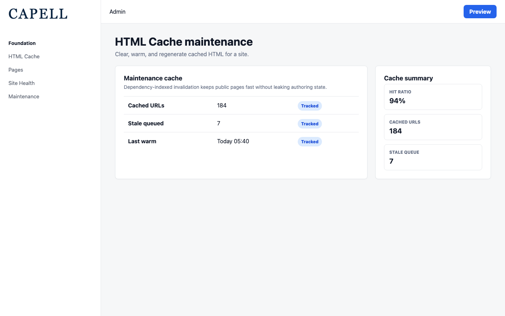
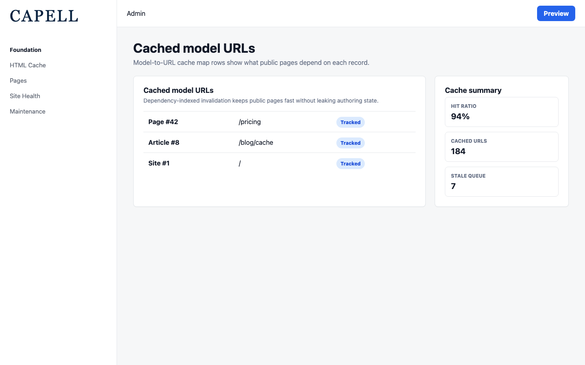

# HTML Cache

<!-- prettier-ignore-start -->

## What This Plugin Adds

HTML Cache is an **Available**, **Schema-owning** Capell package in the **Capell Foundation** product group. It ships as `capell-app/html-cache` and extends these surfaces: admin, frontend.

Full-page static HTML cache for Capell with dependency-indexed invalidation, scheduled stale-regeneration, and public-output safety guarantees. It stores full public HTML responses, indexes their model dependencies, and supports immediate or scheduled stale regeneration.

Administrators inspect coverage, dependency maps, and stale work, then clear, warm, or regenerate cached pages. Anonymous visitors receive cached public HTML without authoring markers or session cookies.

Evidence: [`capell.json`](capell.json), [`src/Http/Middleware/HtmlCacheMiddleware.php`](src/Http/Middleware/HtmlCacheMiddleware.php), [`src/Models/CachedModelUrl.php`](src/Models/CachedModelUrl.php), [`src/Models/StaleCachedUrl.php`](src/Models/StaleCachedUrl.php), [`docs/overview.admin.md`](docs/overview.admin.md), [`docs/screenshots.json`](docs/screenshots.json), [`src/Filament/Pages/MaintenanceCachePage.php`](src/Filament/Pages/MaintenanceCachePage.php), [`tests/Feature/HtmlCacheMiddlewareTest.php`](tests/Feature/HtmlCacheMiddlewareTest.php).

Status details:

- Status: Available
- Tier: free
- Bundle: foundation
- Composer package: `capell-app/html-cache`
- Namespace: `Capell\HtmlCache`
- Theme key: not applicable

## Why It Matters

**For developers:** Middleware eligibility rules and dependency-indexed Actions keep cache writes, invalidation, stale claims, and atomic refresh behavior explicit and testable.

**For teams:** Teams can see whether important URLs are cached, recover from stale output, and diagnose unsupported node-local multi-node deployments without weakening the rule that admin and authoring details stay out of public files.

Evidence: [`src/Actions/RecordCachedModelUrlsAction.php`](src/Actions/RecordCachedModelUrlsAction.php), [`src/Actions/MarkCachedUrlsForModelStaleAction.php`](src/Actions/MarkCachedUrlsForModelStaleAction.php), [`src/Actions/RefreshCachedUrlAtomicallyAction.php`](src/Actions/RefreshCachedUrlAtomicallyAction.php), [`tests/Feature/StaleCachedUrlsTest.php`](tests/Feature/StaleCachedUrlsTest.php), [`docs/admin-guide.md`](docs/admin-guide.md), [`docs/cache-invalidation.md`](docs/cache-invalidation.md), [`src/Health/HtmlCacheHealthCheck.php`](src/Health/HtmlCacheHealthCheck.php), [`src/Actions/BuildHtmlCacheEligibilityReportAction.php`](src/Actions/BuildHtmlCacheEligibilityReportAction.php), [`src/Actions/BuildHtmlCachePublicOutputSafetyDiagnosticsAction.php`](src/Actions/BuildHtmlCachePublicOutputSafetyDiagnosticsAction.php), [`tests/Feature/ExtensionCacheSafetyTest.php`](tests/Feature/ExtensionCacheSafetyTest.php).

## Screens And Workflow

Screenshot contract: `docs/screenshots.json`.

- HTML Cache maintenance cache page (admin, required).
- Cached model URLs resource index (admin, required).
- HTML Cache dashboard widgets (admin, required).
- HTML Cache site health cache map (admin, required).
- Page table cache indicator (admin, required).
- Anonymous public cache hit (frontend, required).
- Static maintenance page output (frontend, required).

## Technical Shape

- Service providers: `Capell\HtmlCache\Providers\HtmlCacheServiceProvider`.
- Config files: `packages/html-cache/config/capell-html-cache.php`.
- Migrations: `packages/html-cache/database/migrations/2026_05_10_190854_01_create_cached_model_urls_table.php`, `packages/html-cache/database/migrations/2026_05_14_000001_create_stale_cached_urls_table.php`, `packages/html-cache/database/migrations/2026_06_07_000001_add_telemetry_to_cached_model_urls_table.php`, `packages/html-cache/database/migrations/2026_07_18_000001_create_html_cache_generation_runs_table.php`.
- Models: `CachedModelUrl`, `HtmlCacheGenerationRun`, `StaleCachedUrl`.
- Filament classes: `PageCachedIconColumn`, `HasPageCacheNotification`, `PageCachePageTableExtender`, `MaintenanceSiteHeaderActionExtender`, `MaintenanceCachePage`, `CachedModelUrlResource`, `ListCachedModelUrls`, `CachedModelUrlsTable`, `HtmlCacheDashboardSettingsContributor`, `CacheCoverageUrlsFilamentWidget`, `HtmlCacheOverviewFilamentWidget`, `HtmlCacheStaleQueueFilamentWidget`.
- Livewire components: `SiteHealthCacheMap`.
- Extension contracts: `CachePurger`, `PageCacheNotifiable`.
- Actions: `BuildCacheMapOverviewAction`, `BuildCachedModelUrlDiagnosticsAction`, `BuildHtmlCacheEligibilityReportAction`, `BuildHtmlCachePublicOutputSafetyDiagnosticsAction`, `ClaimStaleCachedUrlAction`, `ClearAllHtmlCacheAction`, `ClearCachedPageUrlsAction`, `ClearCachedUrlAction`, `ClearCachedUrlsForModelAction`, `ClearCachedUrlsForSurrogateKeysAction`, `BuildHtmlCacheDashboardStatsAction`, `BuildHtmlCacheStaleQueueRowsAction`, `and 22 more`.
- Data objects: `CacheMapModelSummaryData`, `CacheMapOverviewData`, `CacheMapResourceSummaryData`, `HtmlCacheDashboardStatsData`, `EdgeCachePurgeData`, `HtmlCacheClearResult`, `HtmlCacheEligibilityReportData`, `HtmlCacheHitBatchData`.
- Jobs: `FlushHtmlCacheHitBatchJob`, `GenerateMaintenancePagesJob`, `RegisterCachedModelUrlsJob`.
- Scheduled commands: `capell:html-cache:process-stale`.
- Console command classes: `ClearHtmlCacheCommand`, `DiagnoseHtmlCacheCommand`, `ProcessStaleHtmlCacheCommand`, `StaticSiteCommand`.
- Manifest contributions: `admin-page: Capell\HtmlCache\Manifest\HtmlCacheAdminPagesContribution`, `dashboard-widget: Capell\HtmlCache\Manifest\HtmlCacheDashboardFilamentWidgetsContribution`, `model: Capell\HtmlCache\Manifest\HtmlCacheModelsContribution`, `route: Capell\HtmlCache\Manifest\HtmlCacheFrontendRoutesContribution`, `scheduled-job: Capell\HtmlCache\Manifest\HtmlCacheStaleProcessingScheduleContribution`.
- Health checks: `Capell\HtmlCache\Health\HtmlCacheHealthCheck`.
- Blade views: `packages/html-cache/resources/views/filament/pages/maintenance-cache.blade.php`, `packages/html-cache/resources/views/livewire/site-health-cache-map.blade.php`.
- Cache tags: `html-cache`.

## Data Model

- Required tables: `cached_model_urls`, `html_cache_generation_runs`, `stale_cached_urls`.
- Models: `CachedModelUrl`, `HtmlCacheGenerationRun`, `StaleCachedUrl`.
- Core record references in migrations: `sites via site_id`, `languages via language_id`, `site domains via site_domain_id`.
- Migration files: `2026_05_10_190854_01_create_cached_model_urls_table.php`, `2026_05_14_000001_create_stale_cached_urls_table.php`, `2026_06_07_000001_add_telemetry_to_cached_model_urls_table.php`, `2026_07_18_000001_create_html_cache_generation_runs_table.php`.
- Migration impact: run host migrations through the package install flow before opening package surfaces.
- Deletion/retention behaviour: migrations declare null-on-delete relationships; no timed pruning or retention schedule is declared in `capell.json`.

## Install Impact

- Required packages: `capell-app/admin`, `capell-app/core`, `capell-app/frontend`.
- Admin navigation: declares `admin-page: HtmlCacheAdminPagesContribution`; each Filament page or resource controls its own navigation visibility.
- Admin/editor extensions: `dashboard-widget: HtmlCacheDashboardFilamentWidgetsContribution`.
- Permissions: `capell-html-cache.view`, `capell-html-cache.clear`, `capell-html-cache.maintenance.manage`.
- Public routes: registers `HtmlCacheFrontendRoutesContribution`.
- Database changes: package migrations are declared.
- Config: `config/capell-html-cache.php`.
- Settings: no package settings declared.
- Queues or schedules: scheduled commands `capell:html-cache:process-stale`; queue jobs `FlushHtmlCacheHitBatchJob`, `GenerateMaintenancePagesJob`, `RegisterCachedModelUrlsJob`.
- Cache tags: `html-cache`.
- Commands: console command classes detected: `ClearHtmlCacheCommand`, `DiagnoseHtmlCacheCommand`, `ProcessStaleHtmlCacheCommand`, `StaticSiteCommand`.

## Common Pitfalls

- Keep required Capell packages on compatible v4 releases: `capell-app/admin`, `capell-app/core`, `capell-app/frontend`.
- Run migrations before opening package resources or public routes.
- Review package configuration before production-like verification: `config/capell-html-cache.php`.
- Register the host scheduler so these declared commands run at their documented frequencies: `capell:html-cache:process-stale`.
- Keep public Blade and cached HTML free of authoring markers, model IDs, permissions, signed editor URLs, and lazy database queries.
- Custom write integrations must preserve invalidation for `html-cache` cache tags.

## Troubleshooting

| Symptom | Likely cause | Check | Fix |
| --- | --- | --- | --- |
| Package surface is missing after install | Provider or manifest is not loaded | Confirm `capell.json`, package `composer.json`, and provider registration | Reinstall the package, refresh Composer autoload, and clear host caches |
| Admin screen or command fails on missing table | Package migrations have not run | Check the tables listed in `Data Model` | Run host migrations and rerun the focused package test |
| Background work does not run | Queue worker or declared schedule is not active | Check the jobs and scheduled commands listed in `Technical Shape` | Start the queue worker or host scheduler, then run the focused command or package test |
| Public output leaks unexpected state | Render data, cache variation, or authoring boundary has regressed | Check public Blade, cache tags, and public-output safety tests | Move data loading out of Blade and rerun the package public-output tests |

## Quick Start

1. Install the package: `composer require capell-app/html-cache`.
2. Run the required setup: `php artisan migrate`.
3. Open the HTML Cache maintenance cache page and confirm the admin workflow loads.

## Next Steps

- [Package docs](docs/README.md)
- [Overview](docs/overview.md)
- [Admin guide](docs/admin-guide.md)
- Configuration files: [`config/capell-html-cache.php`](config/capell-html-cache.php).
- [Troubleshooting](#troubleshooting)
- [Screenshot contract](docs/screenshots.json)
- [Marketplace assets](docs/assets/marketplace/)
- [Capell content language plan](../../docs/CONTENT_LANGUAGE_PLAN.md)
- [Capell documentation design system](../../docs/DESIGN_SYSTEM.md)
- [Capell and package ERD notes](../../docs/erd/capell-and-package-erds.md)
- Related packages: [Site Discovery](../site-discovery/README.md).
- Focused tests: `vendor/bin/pest packages/html-cache/tests --configuration=phpunit.xml`.

<!-- prettier-ignore-end -->
