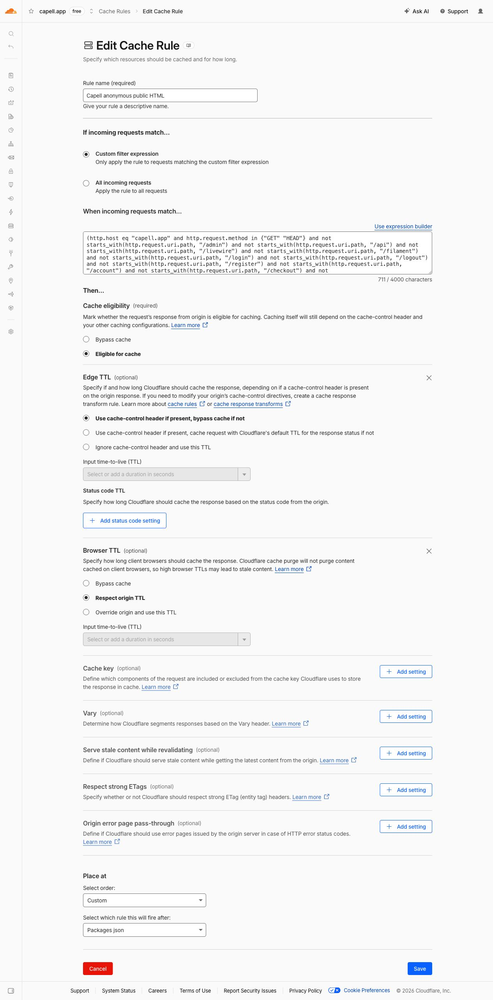
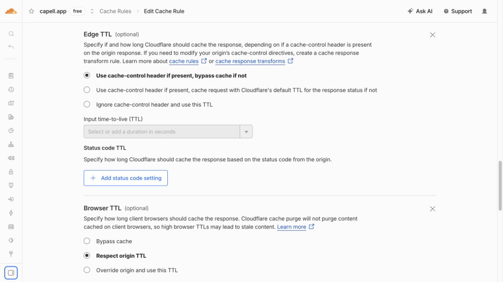
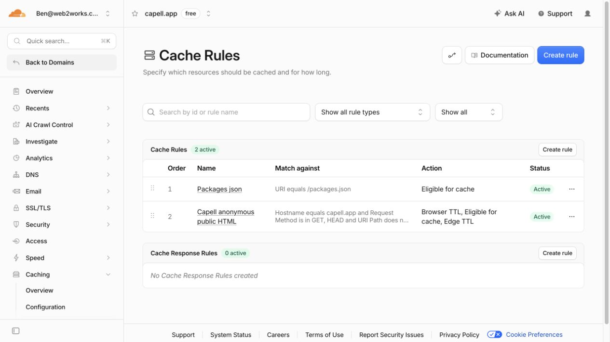

# HTML Cache Invalidation

HTML Cache stores cached HTML files, an index of which models were seen while rendering each URL, and optionally a stale URL queue for scheduled refreshes. Clear or refresh both when a package changes content that may already be cached.

## Invalidation Modes

The default invalidation mode is `instant`: model and routing changes enqueue durable after-commit jobs that delete affected cached files as soon as a queue worker accepts them. Enable scheduled invalidation with:

```env
CAPELL_HTML_CACHE_INVALIDATION_MODE=scheduled
CAPELL_HTML_CACHE_INVALIDATION_SCHEDULE=everyFiveMinutes
CAPELL_HTML_CACHE_INVALIDATION_BATCH_SIZE=100
CAPELL_HTML_CACHE_PROCESSING_TIMEOUT_MINUTES=15
CAPELL_HTML_CACHE_RETRY_BACKOFF_MINUTES=5
CAPELL_HTML_CACHE_MAX_ATTEMPTS=5
```

In `scheduled` mode, model changes insert rows into `stale_cached_urls` instead of deleting cached files immediately. The scheduler runs `capell:html-cache:process-stale` on the configured cadence, renders fresh HTML through the Laravel kernel, and atomically replaces the existing cache file only after the refreshed response is safe and cacheable.

Site-domain scheme, host, path, site, and language mutations enqueue a full cache-clear job immediately after commit, even in scheduled mode. Those changes can make the old file path or public URL unsafe to serve while waiting for the next scheduled refresh cycle.

Route/structure model creates and deletes still trigger broad invalidation because they can change public URL resolution. Non-route model creates and translation updates use the dependency index instead: only cached URLs that previously recorded that model are cleared in `instant` mode or marked stale in `scheduled` mode. This avoids cold-starting the full cache when a leaf record is created.

If a stale URL no longer resolves to an enabled site domain, the processor treats that as confirmation that the old public cache entry is obsolete, deletes the old cache files, and removes matching `cached_model_urls` rows.

Failed refreshes retry after the configured backoff until `max_attempts` is reached. Rows that keep failing are marked `exhausted` for diagnostics and manual follow-up instead of being retried forever.

Every successful URL clear or stale refresh also queues an edge purge. A full local clear and global maintenance transitions queue a complete edge purge. Purge failures retry independently, so a temporary CDN API failure does not roll back the origin cache operation.

## Deployment Topology And Purge Reach

HTML Cache supports three production topologies:

1. One web node with a local `page_cache` disk.
2. Multiple web or queue nodes mounting the same shared POSIX `page_cache` directory.
3. Multiple web nodes with a configured `http` or `cloudflare` purge driver and public traffic delivered through that cache layer.

Multiple web nodes with separate node-local `page_cache` directories and the default `null` purge driver are unsupported. A clear job deletes files only from the node that runs it, so another node can continue serving stale HTML.

Declare the topology so Diagnostics can detect this unsafe combination:

```env
CAPELL_HTML_CACHE_WEB_NODE_COUNT=2
CAPELL_HTML_CACHE_SHARED_PAGE_CACHE=false
```

Set `CAPELL_HTML_CACHE_SHARED_PAGE_CACHE=true` only when every web and queue node mounts the same POSIX directory. Otherwise configure the HTTP or Cloudflare purge driver. The **HTML cache multi-node purge safety** health check fails when more than one web node is declared while `page_cache` is local, shared storage is not acknowledged, and `purge.driver` is `null`.

The `stale_cached_urls` table is not a cross-node purge journal. Scheduled invalidation runs `capell:html-cache:process-stale` with `onOneServer()`, and each row has one global claim and processed state. It safely regenerates one shared cache entry, but it cannot make every node consume the same deletion. A correct per-node journal would require stable node identities, membership and retirement rules, per-node acknowledgements, and bounded retention; do not treat scheduled mode as a workaround for node-local multi-node storage.

## Personalised Route Bypass Examples

The package defaults cannot know application-specific routes, cookies, or request headers. Configure every shared URL whose response varies by visitor state, for example:

```php
'bypass' => [
    'paths' => ['/cart', '/cart/*', '/account/*', '/checkout/*'],
    'cookies' => ['currency_*', 'customer_segment'],
    'headers' => ['Accept-Language', 'X-Geo-Country'],
],
```

Use only the rules your application needs. A header rule bypasses caching whenever that header is present; it does not create a cache variant.

## Cloudflare

Cloudflare does not cache HTML by default. Configure a Cloudflare Cache Rule that makes the intended anonymous public routes cache eligible, while bypassing admin, account, preview, signed, personalised, and cookie-varying routes. Capell emits `Cache-Control`, `Cache-Tag`, and `Surrogate-Key` headers on cacheable responses.

### Production cache rule

The `capell.app` zone uses an active Cache Rule named `Capell anonymous public HTML`. It is deliberately narrower than "all requests":

```text
(http.host eq "capell.app" and http.request.method in {"GET" "HEAD"} and not starts_with(http.request.uri.path, "/admin") and not starts_with(http.request.uri.path, "/api") and not starts_with(http.request.uri.path, "/livewire") and not starts_with(http.request.uri.path, "/filament") and not starts_with(http.request.uri.path, "/login") and not starts_with(http.request.uri.path, "/logout") and not starts_with(http.request.uri.path, "/register") and not starts_with(http.request.uri.path, "/account") and not starts_with(http.request.uri.path, "/checkout") and not starts_with(http.request.uri.path, "/billing") and not starts_with(http.request.uri.path, "/up") and not http.cookie contains "capell_session=")
```

Use these rule settings:

- **Cache eligibility:** Eligible for cache.
- **Edge TTL:** Use the origin `Cache-Control` header when present; bypass cache when it is absent.
- **Browser TTL:** Respect origin TTL.
- **Cache key:** Keep Cloudflare's default query-string behaviour. Capell rejects unsafe or unknown variants at the origin.

Do not replace the Edge TTL policy with "ignore cache-control". Capell relies on `private`, `no-store`, and `no-cache` to keep authenticated, signed, preview, personalised, and otherwise unsafe responses out of the shared edge cache. The path and session-cookie conditions are an additional guard, not a replacement for the origin response policy.

The saved production rule and active rule list are shown below.







After deploying or changing the rule, make two anonymous requests to a public page. The first response should normally be `MISS`; the second should be `HIT` and include an `Age` header. An excluded or private route must remain `DYNAMIC` or `BYPASS`:

```bash
curl -sS -D - -o /dev/null https://capell.app/ \
    | rg -i '^(cache-control|cf-cache-status|age):'
curl -sS -D - -o /dev/null https://capell.app/ \
    | rg -i '^(cache-control|cf-cache-status|age):'
curl -sS -D - -o /dev/null https://capell.app/login \
    | rg -i '^(cache-control|cf-cache-status|age):'
```

The production check on 18 July 2026 returned `MISS` then `HIT` for `/` and `/pricing`. `/login` returned `Cache-Control: no-cache, private` and `CF-Cache-Status: DYNAMIC` on both requests.

Use the native Cloudflare purge adapter:

```env
CAPELL_HTML_CACHE_PURGE_DRIVER=cloudflare
CAPELL_HTML_CACHE_PURGE_TOKEN=your-zone-cache-purge-token
CAPELL_HTML_CACHE_CLOUDFLARE_ZONE_ID=your-32-character-zone-id
```

The API token requires Cache Purge permission for the configured zone. URL purges are the precise baseline for page invalidation; cache tags are used for broader site, language, page, and extension invalidation. Do not configure Cloudflare to cache responses marked `private`, `no-store`, or `no-cache`, or responses that set personalised cookies.

The `page_cache` disk must expose local filesystem paths because refreshes use atomic file replacement. Use a local disk for a single web node or a shared POSIX filesystem mounted by every web and queue node. Object-storage disks are not supported. Site Health reports an error when the disk cannot provide local paths; the deployment-topology check separately reports unsafe multi-node purge configuration.

## Main Actions

| Action                              | Use it when                                                                  |
| ----------------------------------- | ---------------------------------------------------------------------------- |
| `ClearCachedUrlAction`              | You know the public URL that should be removed from the cache.               |
| `ClearCachedPageUrlsAction`         | You have a collection of URLs and want a simple count of cleared entries.    |
| `ClearCachedUrlsForModelAction`     | You changed one model and want to clear every cached URL that referenced it. |
| `MarkCachedUrlStaleAction`          | You know a URL should be refreshed on the next scheduled cycle.              |
| `MarkCachedUrlsForModelStaleAction` | You changed one model and want scheduled mode to refresh indexed URLs.       |
| `MarkAllCachedUrlsStaleAction`      | Broad routing/domain changes should queue all indexed URLs as stale.         |
| `ProcessStaleHtmlCacheAction`       | Process pending stale URLs and atomically refresh their cached HTML.         |
| `RecordCachedModelUrlsAction`       | A render pass knows which models contributed to a cached URL.                |
| `GenerateStaticSiteAction`          | A full static generation run is needed for one `Site`.                       |
| `GenerateStaticSitesAction`         | Static generation should run for all selected sites.                         |

The admin cache map reads `cached_model_urls`; it does not scan public HTML on every request. If a package renders model-backed content but never records dependencies, cache invalidation can only work by URL.

## Clear One URL

```php
use Capell\HtmlCache\Actions\ClearCachedUrlAction;

ClearCachedUrlAction::run('https://example.test/about', refresh: true);
```

`refresh: true` dispatches `Capell\Core\Actions\VisitUrlAction` after the file and index rows are removed. Use it only when the URL should be warmed immediately.

## Clear Every URL For A Model

```php
use Capell\HtmlCache\Actions\ClearCachedUrlsForModelAction;

$cleared = ClearCachedUrlsForModelAction::run($article, refresh: false);
```

This looks up rows where `cacheable_type` matches `$article->getMorphClass()` and `cacheable_id` matches the model key. If the model was never recorded with `RecordCachedModelUrlsAction`, the action returns `0`.

## Record Dependencies During Rendering

```php
use Capell\HtmlCache\Actions\RecordCachedModelUrlsAction;

RecordCachedModelUrlsAction::run($url, [
    $article->getMorphClass() => [$article->getKey()],
    $author->getMorphClass() => [$author->getKey()],
]);
```

`RecordCachedModelUrlsAction` resolves the site domain and path from the URL, upserts the current dependencies, and removes stale dependencies for the same URL hash.

## Configuration

| Key                                                         | Purpose                                                                                                                                                   |
| ----------------------------------------------------------- | --------------------------------------------------------------------------------------------------------------------------------------------------------- |
| `capell-html-cache.enabled`                                 | Turns HTML cache behaviour on or off.                                                                                                                     |
| `capell-html-cache.write_enabled`                           | Allows cache writes. Disable this when investigating output safety.                                                                                       |
| `capell-html-cache.minify_html`                             | Controls minification before writing cached HTML.                                                                                                         |
| `capell-html-cache.cache_ttl`                               | Backward-compatible source for shared HTTP cache age when no explicit `shared_max_age` is configured.                                                     |
| `capell-html-cache.filesystem_ttl_seconds`                  | Hard expiry backstop for filesystem entries; `0` disables time-based expiry.                                                                              |
| `capell-html-cache.error_pages.max_files_per_host`          | Maximum cached `.404.html` files per host cache root; `0` disables cached 404 writes.                                                                     |
| `capell-html-cache.error_pages.retain_after_prune`          | Number of newest cached 404 files retained when the per-host cap is reached.                                                                              |
| `capell-html-cache.hit_recording.flush_delay_seconds`       | Delay used to batch cache-hit counters before one queued database update.                                                                                 |
| `capell-html-cache.hit_recording.buffer_ttl_seconds`        | Safety TTL for pending cache-hit counters and their scheduled-flush marker.                                                                               |
| `capell-html-cache.http_cache.shared_max_age`               | `s-maxage` value for public cached responses; defaults to `cache_ttl / 6` when unset.                                                                     |
| `capell-html-cache.http_cache.browser_max_age`              | Browser `max-age` value for public cached responses.                                                                                                      |
| `capell-html-cache.http_cache.stale_while_revalidate`       | CDN/browser `stale-while-revalidate` directive value.                                                                                                     |
| `capell-html-cache.request_coalescing.*`                    | Short per-URL lock and wait values that collapse simultaneous origin cache misses into one render.                                                        |
| `capell-html-cache.cache_skip_authenticated`                | Keeps authenticated responses out of the public cache.                                                                                                    |
| `capell-html-cache.bypass.paths`                            | Wildcard path rules that bypass public cache reads and writes.                                                                                            |
| `capell-html-cache.bypass.cookies`                          | Wildcard cookie-name rules that bypass public cache reads and writes. Use for personalization or variant cookies that are not encoded in the URL.         |
| `capell-html-cache.bypass.headers`                          | Wildcard header-name rules that bypass public cache reads and writes. Use for shared-URL locale or segment negotiation headers such as `Accept-Language`. |
| `capell-html-cache.access_gate.active_area_cache_seconds`   | Short TTL for the access-gate active-area lookup used by anonymous cache decisions. Set `0` to disable.                                                   |
| `capell-html-cache.invalidation.mode`                       | `instant` or `scheduled`. Default `instant`.                                                                                                              |
| `capell-html-cache.invalidation.schedule`                   | Scheduler frequency for stale processing. Default `everyFiveMinutes`.                                                                                     |
| `capell-html-cache.invalidation.batch_size`                 | Default stale URL batch size.                                                                                                                             |
| `capell-html-cache.invalidation.processing_timeout_minutes` | Minutes before a `processing` stale row may be claimed again.                                                                                             |
| `capell-html-cache.invalidation.retry_backoff_minutes`      | Minutes before a failed stale row may be retried.                                                                                                         |
| `capell-html-cache.invalidation.max_attempts`               | Maximum refresh attempts before a stale row becomes `exhausted`.                                                                                          |
| `capell-html-cache.retention.processed_stale_days`          | Days to retain completed stale-refresh rows for diagnostics.                                                                                              |
| `capell-html-cache.retention.generation_run_days`           | Days to retain completed or failed static-generation run records.                                                                                         |
| `capell-html-cache.purge.driver`                            | Edge purge adapter: `null`, `http`, or `cloudflare`.                                                                                                      |
| `capell-html-cache.purge.token`                             | Bearer token for the configured edge purge API.                                                                                                           |
| `capell-html-cache.purge.cloudflare.zone_id`                | Cloudflare zone ID used by the native purge adapter.                                                                                                      |
| `capell-html-cache.deployment.web_node_count`               | Number of web nodes that may serve public HTML; used by the deployment-topology health diagnostic.                                                        |
| `capell-html-cache.deployment.shared_page_cache`            | Acknowledges that every web and queue node mounts the same POSIX `page_cache` directory.                                                                  |
| `capell-html-cache.model_event_registration_mode`           | Controls model event registration timing; default is `deferred`.                                                                                          |
| `capell-html-cache.static_generation.internal_requests`     | Renders static generation through the current Laravel kernel; enabled by default for reliable completion reporting.                                       |
| `capell-html-cache.public_html_authoring_markers`           | Strings used by diagnostics to detect authoring leakage in public HTML.                                                                                   |

Hit telemetry is operational metadata, not a durable event log. Pending counters and the scheduled-flush marker expire after `hit_recording.buffer_ttl_seconds`; if queue workers remain unavailable longer than that window, some hit and byte totals can be lost. This does not affect cached HTML correctness. Monitor queue workers and set the TTL longer than the longest outage for which telemetry must be retained.

## Console

```bash
vendor/bin/pest packages/html-cache/tests --configuration=phpunit.xml
```

The package command is:

```text
capell:html-cache:process-stale {--limit=}
capell:html-cache:diagnose {url?} {--site=} {--render} {--json}
capell:static-site {--site=} {--internal} {--refresh}
```

`capell:html-cache:process-stale` is scheduled automatically when `capell-html-cache.invalidation.mode` is `scheduled`. `--limit` overrides the configured batch size for one run.

`capell:html-cache:diagnose --render` renders the URL through the current kernel and reports the actual response status, cache directives, `Vary`, cookies, and edge tag headers. Without `--render`, it performs the cheaper request/index eligibility check only.

`--internal` renders through the current Laravel kernel. `--refresh` deletes affected cached files before rendering.

Internal static generation and stale-refresh renders are marked as synthetic HTML-cache renders. They still record the current model dependency index for the rendered URL, but they do it synchronously inside the synthetic request instead of deferring or queueing another `RegisterCachedModelUrlsJob`.

## Extension Point

Implement `Capell\HtmlCache\Contracts\PageCacheNotifiable` when a class needs to react after a page cache entry is recorded:

```php
use Capell\HtmlCache\Contracts\PageCacheNotifiable;
use Illuminate\Database\Eloquent\Model;

final class SearchIndexCacheNotifier implements PageCacheNotifiable
{
    public function notifyPageCached(Model $model): void
    {
        // Keep side effects small; this runs from cache recording paths.
    }
}
```

Keep notifications cheap. Cache writes happen on public page renders, so slow work belongs on a queue.

## Public Output Safety

HTML Cache must remain safe for anonymous visitors, signed-in users, admins, crawlers, and static exports. Do not put authoring attributes, model IDs, signed editor URLs, field paths, package names, or permission hints into cached HTML. If a package needs admin editing, use Frontend Authoring's post-load beacon.

Cache paths are also part of the public-output safety boundary. Encoded or double-encoded dot segments, control bytes, backslashes, and oversized path segments are rejected before cache reads or writes. Invalid paths are treated as uncacheable instead of being normalized into a nearby public cache file.
