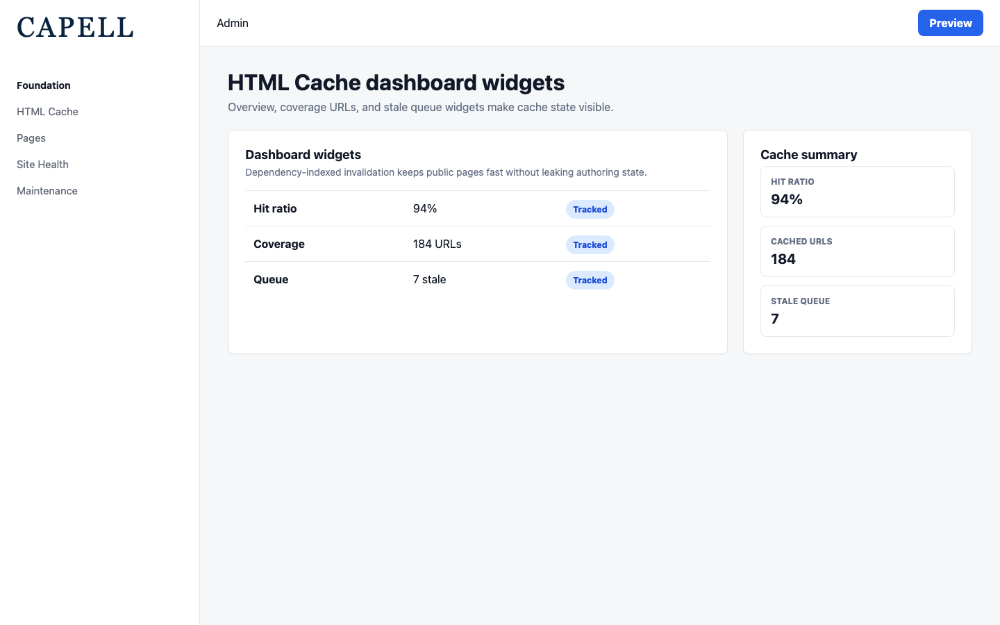
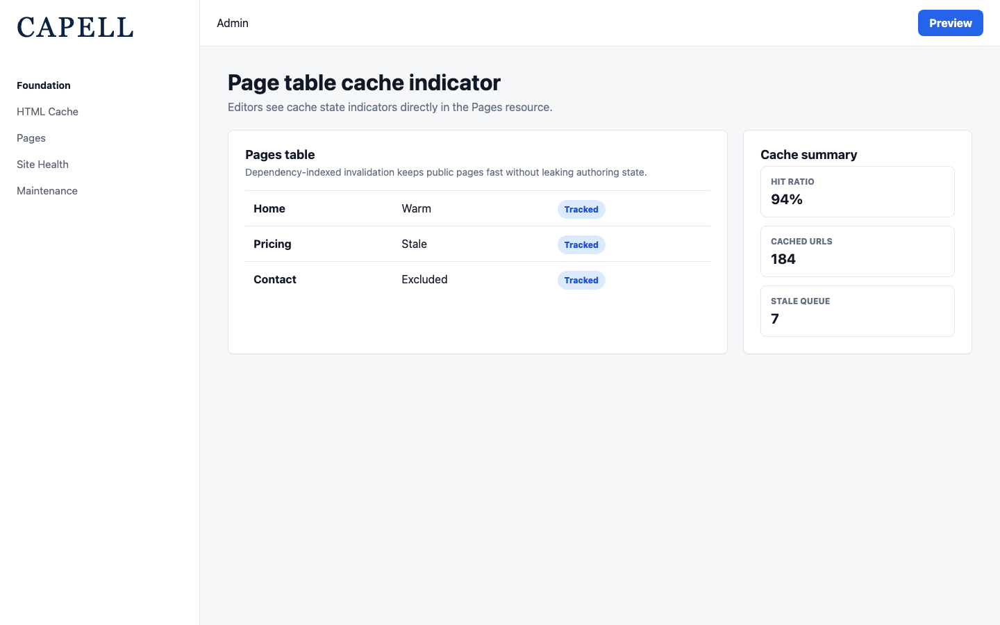
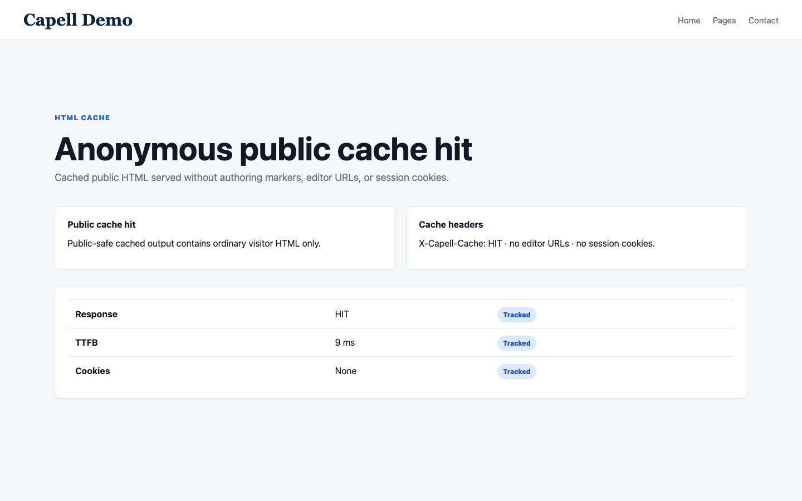
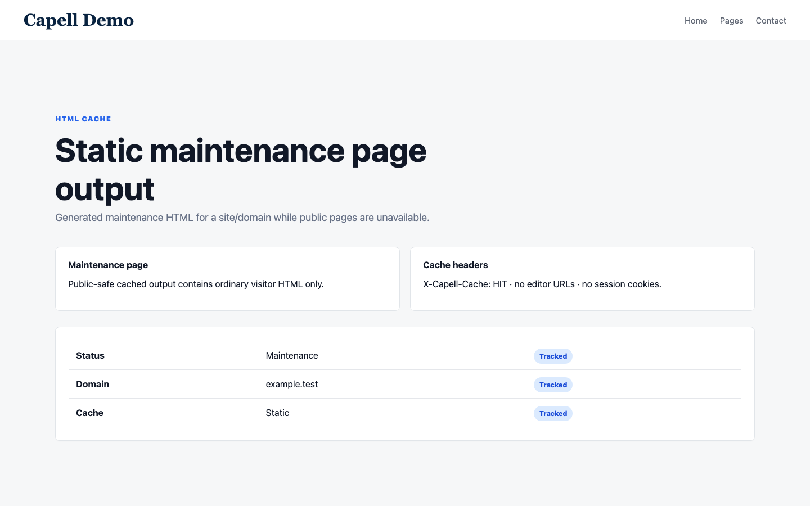

# HTML Cache

<!-- prettier-ignore-start -->

## What This Plugin Adds

HTML Cache is an **Available**, **Schema-owning** Capell package in the **Capell Foundation** product group. It ships as `capell-app/html-cache` and extends these surfaces: admin, frontend.

Full-page static HTML cache for Capell with dependency-indexed invalidation, scheduled stale-regeneration, and public-output safety guarantees.

After install, admins get package-owned cache management surfaces. Public requests do not receive package-owned routes; the package contributes frontend middleware that can serve safe cached HTML for existing Capell frontend routes.

Status details:

- Status: Available
- Tier: free
- Bundle: foundation
- Composer package: `capell-app/html-cache`
- Namespace: `Capell\HtmlCache`
- Theme key: not applicable

## Why It Matters

**For developers:** The package gives developers package-owned service providers, Actions, Data objects, models, Filament classes, and Blade views instead of pushing this behaviour into core or application code.

**For teams:** Serve Capell pages as static HTML for sub-millisecond responses - with automatic, dependency-aware invalidation that keeps cached pages fresh and never leaks gated or authoring content to anonymous visitors.

## Screens And Workflow

Screenshot contract: `screenshots.json`.

- HTML Cache maintenance cache page (admin, required).
- Cached model URLs resource index (admin, required).
- HTML Cache dashboard widgets (admin, required).
- HTML Cache site health cache map (admin, required).
- Page table cache indicator (admin, required).
- Anonymous public cache hit (frontend, required).
- Static maintenance page output (frontend, required).

## Screenshot Evidence

These captures are the package-owned visual contract for the admin pages, public pages, actions, workflows, and feature surfaces described above. Keep this section aligned with `docs/screenshots.json` whenever the package surface changes.

### HTML Cache maintenance cache page

- Surface: admin · Target: /admin/html-cache/maintenance-cache.
- Documents: An administrator clears, warms, or regenerates cached HTML for a site.
- Capture notes: Capture the maintenance cache controls after at least one site exists.

### Cached model URLs resource index

- Surface: admin · Target: admin-resource.
- Documents: An administrator reviews model-to-URL cache map rows after a public page has been warmed.
- Capture notes: Capture after warming a public page so cache map rows exist.

### HTML Cache dashboard widgets

- Surface: admin · Target: /admin.
- Documents: An administrator checks cache overview, coverage, and stale queue widgets.
- Capture notes: Capture cache overview, cache coverage URLs, and stale queue widgets.

### HTML Cache site health cache map

- Surface: admin · Target: /admin/site-health.
- Documents: An operator reviews cache-map diagnostics and public-output safety checks in Site Health.
- Capture notes: Capture package diagnostics and public output safety checks on the core Site Health page.

### Page table cache indicator

- Surface: admin · Target: /admin/pages.
- Documents: An editor sees cache state indicators directly in the core Pages resource.
- Capture notes: Capture the core Pages resource with the cache table extension visible.

### Anonymous public cache hit

- Surface: frontend · Target: frontend-url.
- Documents: An anonymous visitor receives cached public HTML with no authoring markers, editor URLs, or session cookies.
- Capture notes: Capture anonymous public output and verify no authoring markers, editor URLs, or session cookies are exposed.

### Static maintenance page output

- Surface: frontend · Target: frontend-url.
- Documents: An anonymous visitor sees the generated static maintenance page for a site/domain.
- Capture notes: Capture generated maintenance HTML for a site/domain after using the maintenance cache page.

## Technical Shape

- Service providers: `Capell\HtmlCache\Providers\HtmlCacheServiceProvider`.
- Config files: `packages/html-cache/config/capell-html-cache.php`.
- Migrations: `packages/html-cache/database/migrations/2026_05_10_190854_01_create_cached_model_urls_table.php`, `packages/html-cache/database/migrations/2026_05_14_000001_create_stale_cached_urls_table.php`, `packages/html-cache/database/migrations/2026_06_07_000001_add_telemetry_to_cached_model_urls_table.php`.
- Models: `CachedModelUrl`, `StaleCachedUrl`.
- Filament classes: `PageCachedIconColumn`, `HasPageCacheNotification`, `PageCachePageTableExtender`, `MaintenanceSiteHeaderActionExtender`, `MaintenanceCachePage`, `CachedModelUrlResource`, `ListCachedModelUrls`, `CachedModelUrlsTable`, `HtmlCacheDashboardSettingsContributor`, `CacheCoverageUrlsWidget`, `HtmlCacheOverviewWidget`, `HtmlCacheStaleQueueWidget`.
- Livewire components: `SiteHealthCacheMap`.
- Actions: `BuildCacheMapOverviewAction`, `BuildCachedModelUrlDiagnosticsAction`, `BuildHtmlCacheEligibilityReportAction`, `BuildHtmlCachePublicOutputSafetyDiagnosticsAction`, `ClearAllHtmlCacheAction`, `ClearCachedPageUrlsAction`, `ClearCachedUrlAction`, `ClearCachedUrlsForModelAction`, `ClearCachedUrlsForSurrogateKeysAction`, `BuildHtmlCacheDashboardStatsAction`, `BuildHtmlCacheStaleQueueRowsAction`, `BuildHtmlCacheUrlRowsAction`, `and 14 more`.
- Data objects: `CacheMapModelSummaryData`, `CacheMapOverviewData`, `CacheMapResourceSummaryData`, `HtmlCacheDashboardStatsData`, `HtmlCacheClearResult`, `HtmlCacheEligibilityReportData`.
- Jobs: `RegisterCachedModelUrlsJob`.
- Console command classes: `ClearHtmlCacheCommand`, `DiagnoseHtmlCacheCommand`, `ProcessStaleHtmlCacheCommand`, `StaticSiteCommand`.
- Health checks: `Capell\HtmlCache\Health\HtmlCacheHealthCheck`.
- Manifest contributions: admin page, dashboard widgets, models, frontend route middleware, and scheduled stale-processing job.
- Blade views: `packages/html-cache/resources/views/filament/pages/maintenance-cache.blade.php`, `packages/html-cache/resources/views/livewire/site-health-cache-map.blade.php`.
- Cache tags: `html-cache`.

## Data Model

- Models: `CachedModelUrl`, `StaleCachedUrl`.
- Migration files: `2026_05_10_190854_01_create_cached_model_urls_table.php`, `2026_05_14_000001_create_stale_cached_urls_table.php`, `2026_06_07_000001_add_telemetry_to_cached_model_urls_table.php`.
- Migration impact: run host migrations through the package install flow before opening package surfaces.
- Deletion/retention behaviour: Docs gap unless the package has an explicit pruning command, retention setting, or tested cascade path.

## Install Impact

- Admin navigation: adds package-owned Filament classes when registered.
- Permissions: `capell-html-cache.view`, `capell-html-cache.clear`.
- Public routes: none. Frontend route contribution is middleware-only: `frontend.cache`, `frontend.model_events`, and `frontend.no_session_cookies_on_cache`.
- Database changes: package migrations are declared.
- Settings: no package settings declared.
- Queues or schedules: `capell:html-cache:process-stale` is scheduled only when `capell-html-cache.invalidation.mode=scheduled`; the default frequency is `everyFiveMinutes`.
- Cache tags: `html-cache`.
- Commands: console command classes detected: `ClearHtmlCacheCommand`, `DiagnoseHtmlCacheCommand`, `ProcessStaleHtmlCacheCommand`, `StaticSiteCommand`.

## Common Pitfalls

- Run migrations before opening package resources or public routes.
- Keep public Blade and cached HTML free of authoring markers, model IDs, permissions, signed editor URLs, and lazy database queries.
- Treat hostile paths as uncacheable. Encoded dot segments, control bytes, backslashes, and oversized path segments are rejected before disk reads or writes.
- Keep `composer.json`, `composer.local.json`, `capell.json`, docs, screenshots, and tests aligned when the package surface changes.

## Troubleshooting

| Symptom | Likely cause | Check | Fix |
| --- | --- | --- | --- |
| Package surface is missing after install | Provider or manifest is not loaded | Confirm `capell.json`, package `composer.json`, and provider registration | Reinstall the package, refresh Composer autoload, and clear host caches |
| Admin screen or command fails on missing table | Package migrations have not run | Check the tables listed in `Data Model` | Run host migrations and rerun the focused package test |
| Background work does not run | Queue worker or scheduled command is not active | Check package jobs, commands, and host scheduler configuration | Start the queue or scheduler, then run the focused command or package test |
| Public output leaks unexpected state | Render data, cache variation, or authoring boundary has regressed | Check public Blade, cache tags, and public-output safety tests | Move data loading out of Blade and rerun the package public-output tests |

## Quick Start

1. Install the package: `composer require capell-app/html-cache`.
2. Run the required setup: `php artisan migrate`.
3. Open the related Capell admin surface and verify HTML Cache appears.

## Next Steps

- [Package docs index](README.md)
- [Screenshot contract](screenshots.json)
- [Marketplace assets](assets/marketplace/)
- [Capell content language plan](../../../docs/CONTENT_LANGUAGE_PLAN.md)
- [Capell documentation design system](../../../docs/DESIGN_SYSTEM.md)
- [Capell and package ERD notes](../../../docs/erd/capell-and-package-erds.md)
- Related packages: [Site Discovery](../../site-discovery/README.md).
- Focused tests: `vendor/bin/pest packages/html-cache/tests --configuration=phpunit.xml`.

<!-- prettier-ignore-end -->
